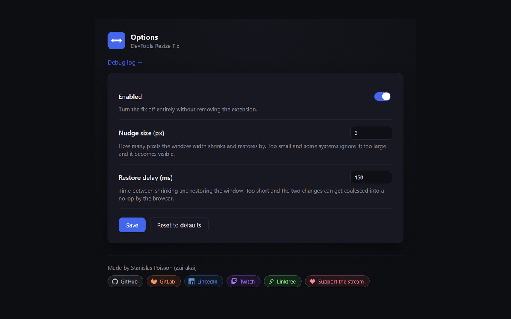
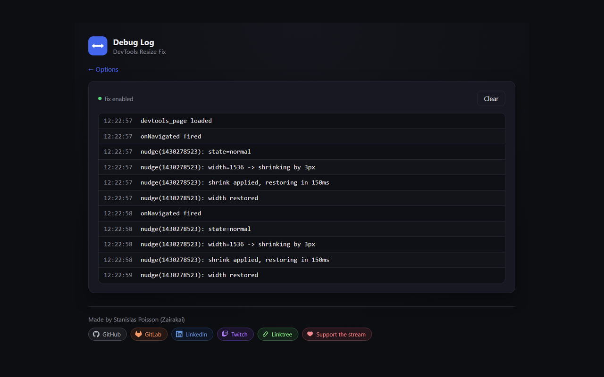

<div align="center">


# DevTools Resize Fix

**Fixes the Chromium bug where docked DevTools breaks page layout after reload.**

[](LICENSE)
[](manifest.json)
[](https://chromewebstore.google.com/detail/devtools-resize-fix/dcpnklkeicghdphjbcbaccemjofdagli)

</div>

---

A tiny Chrome/Chromium extension that fixes an annoying, long-standing
Chromium bug: when DevTools is docked (bottom, side, or right) and you
reload the inspected page, the page's layout sometimes fails to reflow
to the correct viewport size. Content visually slides or gets clipped
under the docked panel until something forces an actual window resize.

This extension forces that resize automatically, invisibly, every time
the inspected tab navigates - so you never have to manually drag the
window or toggle DevTools off and on again to "unstick" the layout.

## Install

[Install from the Chrome Web Store](https://chromewebstore.google.com/detail/devtools-resize-fix/dcpnklkeicghdphjbcbaccemjofdagli)
(the badge above links there too).

<details>
<summary>Manually, from a release zip</summary>

1. Download the latest `devtools-resize-fix-vX.Y.Z.zip` from the
   [Releases](../../releases) page and unzip it somewhere permanent.
2. Go to `chrome://extensions`.
3. Enable **Developer mode** (top right).
4. Click **Load unpacked** and select the unzipped folder.

</details>

<details>
<summary>From source</summary>

```sh
git clone https://github.com/Stanislas-Poisson/devtools-resize-fix.git
```

Then follow the "Load unpacked" steps above, pointing at the cloned
folder.

</details>

## Options

Open `chrome-extension://<extension-id>/options.html` directly, or from
the extensions puzzle-piece icon in the toolbar → find **DevTools Resize
Fix** → right-click → **Options**, to adjust:

- **Enabled** - turn the fix off without removing the extension.
- **Nudge size (px)** - how far the window shrinks and restores. Too
  small and some systems silently ignore it.
- **Restore delay (ms)** - time between the shrink and the restore. Too
  short and the two changes can get coalesced into a no-op.

<details>
<summary>Screenshot</summary>



</details>

## Limitations

- Maximized windows flicker through a brief `normal`/`maximized` cycle
  instead of the subtler plain nudge (see [How it works](#how-it-works)).
- The fix runs on every navigation while DevTools is open, whether
  DevTools is actually docked or undocked (floating in its own window).
  When undocked, the nudge is harmless but unnecessary - there is no
  public Chrome API to detect dock state from an extension.
- Only verified on Chromium-based browsers (Chrome, Edge, Brave, ...).
  Not currently packaged for Firefox - the equivalent bug hasn't been
  confirmed there; open an issue if you can reproduce it.

## Debugging

`devtools_page` scripts have no console reachable through normal
DevTools inspection, so the extension logs its own operations to
`chrome.storage.local` instead. Open
`chrome-extension://<extension-id>/debug.html` (a plain page, no special
DevTools gymnastics needed) to see what it's doing in real time.

<details>
<summary>Screenshot</summary>



</details>

<a id="how-it-works"></a>

<details>
<summary>How it works</summary>

The extension only runs while DevTools is actually open on a tab (via
Chrome's `devtools_page` API - it is not a background script watching
every tab). On every navigation of the inspected tab, it nudges the
browser window's width by a few pixels and back a short delay later.
That's enough to force Chromium to recompute layout; the nudge itself is
close to imperceptible. Both the nudge size and the delay are
configurable (see [Options](#options)) - the right values depend a bit
on your OS and machine, since it's ultimately about winning a race
against Chromium's own resize/layout timing.

If the window is maximized, it can't be resized directly, so the
extension pins its bounds and briefly drops it to `normal` and back
instead of letting it snap through its pre-maximize size - still more
noticeable than the plain nudge on a `normal` window (see
[Limitations](#limitations)).

No `host_permissions` are requested: the extension never reads or
touches page content on any site, so it works everywhere, and Chrome
doesn't need to warn you about "reading your data on all websites".

</details>

<details>
<summary>Rebuilding the icons</summary>

Icons are generated deterministically with Pillow, no external assets:

```sh
python3 icons/generate.py
```

</details>

## License

MIT - see [LICENSE](LICENSE).

---

<div align="center">


### Stanislas Poisson - Zairakai

<!-- Drafted by Claude at Stanislas's request - edit freely, it's a guess, not a bio. -->
*Software developer who occasionally gets annoyed enough at a bug to fix
it and ship the fix as a tiny open-source tool - this extension being a
good example. Also streams on Twitch as **Zairakai**, mixing code and
games with the chat.*

[](https://github.com/Stanislas-Poisson)
[](https://gitlab.com/Stanislas-Poisson)
[](https://www.linkedin.com/in/stanislasp/)
[](https://twitch.tv/zairakai)
[](https://linktr.ee/Zairakai)
[](https://pots.lydia.me/collect/pots?id=18363-dons-stream)

</div>
